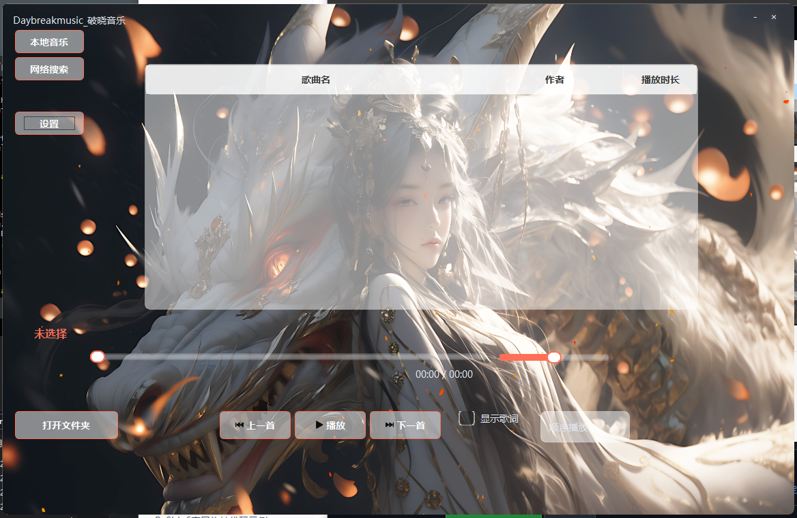
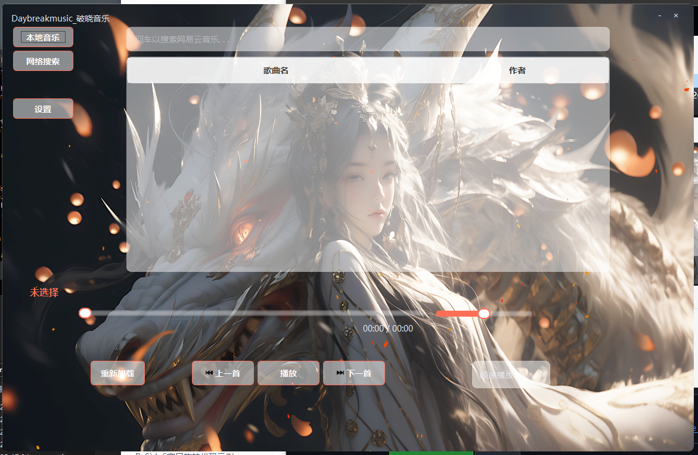
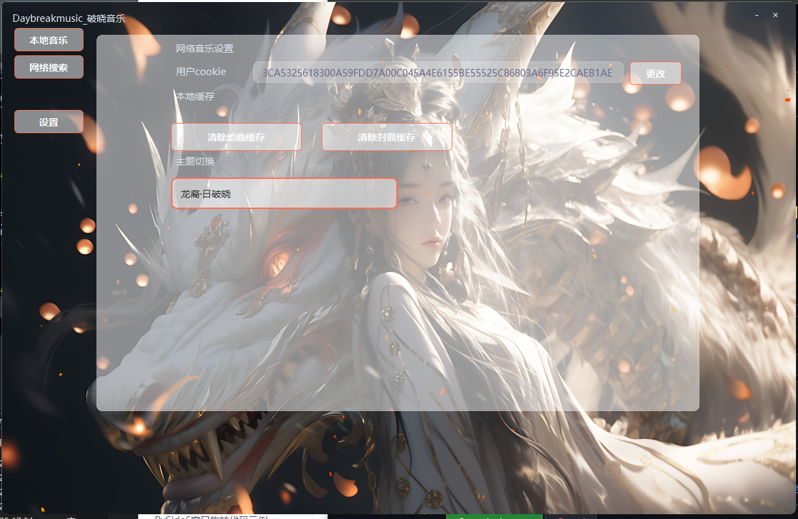

##本项目是基于pyside6开发的简易音乐软件,支持网易云音乐解析.
##软件截图:
##
##
##
## 主题
*   **多主题切换**：
    *   **默认主题**：简洁标准风格。
    *   **性能模式**：纯色背景，降低 GPU 渲染消耗。
    *   **龙裔·日破晓**：高画质定制主题，包含精细的光影与粒子效果。

#### 1. ⚙️ 设置与管理中心 (Settings Panel)
*   **网易云音乐集成**：
    *   提供 **用户 Cookie 配置入口**，用户可粘贴网页版 Cookie 以解锁在线搜索、高品质音源试听及会员歌曲播放权限。
    *   设有“更改”按钮，方便随时更新授权信息。
*   **缓存管理**：
    *   独立的 **清除歌曲缓存** 与 **清除封面缓存** 按钮，帮助用户一键释放磁盘空间，保持软件轻量运行。
*   **主题切换器**：
    *   下拉菜单直观展示可用主题，当前选中项（如“龙裔·日破晓”）采用橙色高亮显示，交互反馈清晰。

#### 2. 🎵 本地音乐播放 (Local Playback)
*   **信息展示**：列表清晰展示 **歌曲名**、**作者**、**播放时长**，支持整行选择与高亮。
*   **音乐播放支持**：
    *   可视化音频进度，支持拖拽跳转，实时显示 `当前时间 / 总时长`。
    *   核心控制：上一首、播放/暂停（图标随状态切换）、下一首。
    *   **歌词显示**：复选框一键开启/关闭歌词悬浮窗。
    *   **播放模式**：支持顺序、循环、随机等多种模式切换。

#### 3. 🔍 在线音乐搜索 (Online Search)
*   **网易云接口**：
    *   搜索结果以表格形式呈现，包含 **歌曲名** 与 **作者**
*   **快捷操作**：
    *   底部设有 **重新加载** 按钮，用于刷新搜索状态或重置列表。

### 使用的模块
  * 核心框架   : Python 3.13 + PySide6 (Qt for Python)
  * UI 构建    : Qt Designer (.ui 文件) -> PySide6-uic 编译
  * 音频处理   : PySide6.QtMultimedia (QMediaPlayer, QAudioOutput)
  * 元数据解析 : Mutagen (读取 ID3 标签、封面提取)
  * 歌词解析   : pylrc (LRC 歌词时间轴解析)
  * 网络请求   : Requests (HTTP/API 调用), Cryptography (AES 加密/解密)
  * 图像处理   : Pillow (PIL) (封面图处理与 Base64 转换)
  * 配置文件   : ConfigParser (读写 .ini 配置)
  * 组件模块   : 自定义 QDialog (缓存清理、关于页面)

> **⚠️ 免责声明**：此软件通过接口调用实现网易云音乐的获取,cookie请用户自行提供,请自觉遵守法律法规,保护正版!
> ##开发者联系方式QQ:3969204597
> ##打赏
> ##
